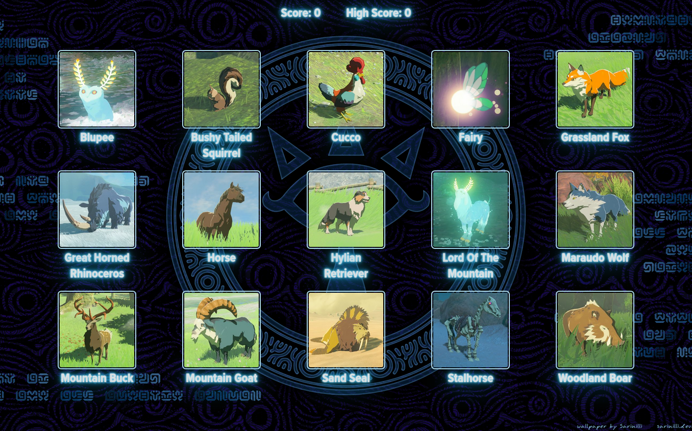

# Legend of Zelda - Memory Game

## Overview

This project is a memory game played with cards. The player clicks on a card, then the cards are shuffled. The player must continue to click on cards trying to click on each card once. The game ends when the player clicks on any card a second time, or has successfully click on every card.

### Live Demo

Find a live demo of the project [here](https://memory-game-loz.netlify.app/).

### Screenshot

The guidelines for this project are from [The Odin Project](https://www.theodinproject.com/) as part of the lesson [Project: Memory Card](https://www.theodinproject.com/lessons/node-path-react-new-memory-card).

## Running this project

### Live Version

[Legend of Zelda - Memory Card Game](https://memory-game-loz.netlify.app/)

### Running locally

1. Clone this project locally
2. Run npm install in your bash / command line
3. Run npm run dev in your bash / command line
4. Enjoy the game

## Dependencies

- React
- React-DOM
- Vite
- ESLint

## Attributions

- Card images from [Hyrule Compendium API](https://gadhagod.github.io/Hyrule-Compendium-API/#/).
